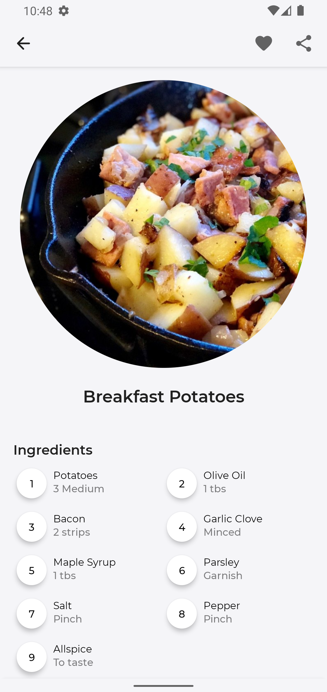

# 🍽️ Meal App  

> Meal-App is a receipe app which provides receipes to create the best meals. It contains carefully chosen and verified recipes with step by step guides. 
Have any meal in mind? Just search and get meals from an open, crowd-sourced database from around the world powered by the `Themealdb's API`

## Preview

&nbsp;&nbsp;&nbsp;&nbsp;

&nbsp;&nbsp;&nbsp;&nbsp;

&nbsp;&nbsp;&nbsp;&nbsp;

## 🛠 Built With 
- [Kotlin](https://kotlinlang.org/) - First class and official programming language for Android development.
- [Jetpack Compose](https://developer.android.com/jetpack/compose) - Android’s recommended modern toolkit for building native UI.
- [MVVM Architecture](https://developer.android.com/topic/architecture?gclid=CjwKCAiA7vWcBhBUEiwAXieIti2J467093HtRTEp-H4LJKu2NlwV5sQtEftMVE03549xPm3bTlf03BoCVKsQAvD_BwE&gclsrc=aw.ds#recommended-app-arch) - Follows Model View ViewModel architecture
- [Flow](https://developer.android.com/kotlin/flow) -  A flow is a type that can emit multiple values sequentially, as opposed to suspend functions that return only a single value.
- [ViewModel](https://developer.android.com/topic/libraries/architecture/viewmodel) - Stores UI-related data and capture UI changes. 
- [Room](https://developer.android.com/topic/libraries/architecture/room) - SQLite object mapping library.
- [TheMealDB](https://www.themealdb.com/api.php) - API for fetching Recipes

